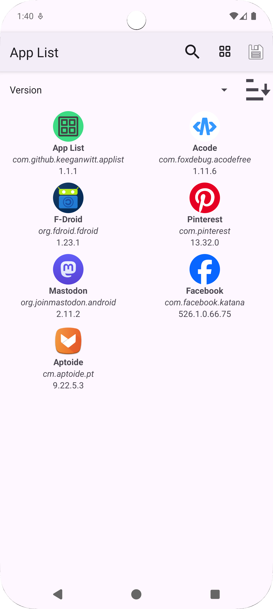
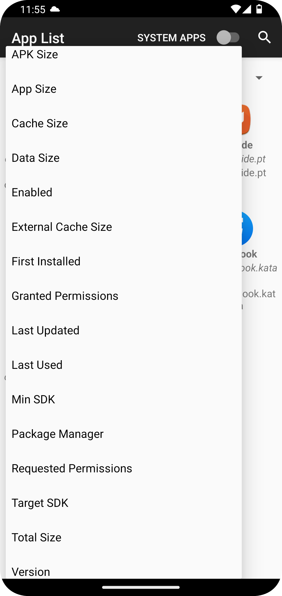

# App List

This app lists a selected piece of application info across all apps, to see that information at a glance.
Some of the useful things that can be displayed are

* The package manager that installed the app
* The target SDK
* The number of requested/granted permissions
* Whether the app is enabled

## Setup

This project uses Firebase. For security reasons, the `google-services.json` file is not included in the repository.

To build the project:
1. The build script will automatically create a `app/google-services.json` file from `app/google-services.json.template` if it's missing. This allows the project to build with dummy values.
2. To use Firebase features, you must replace `app/google-services.json` with your own valid configuration file from the Firebase Console.
