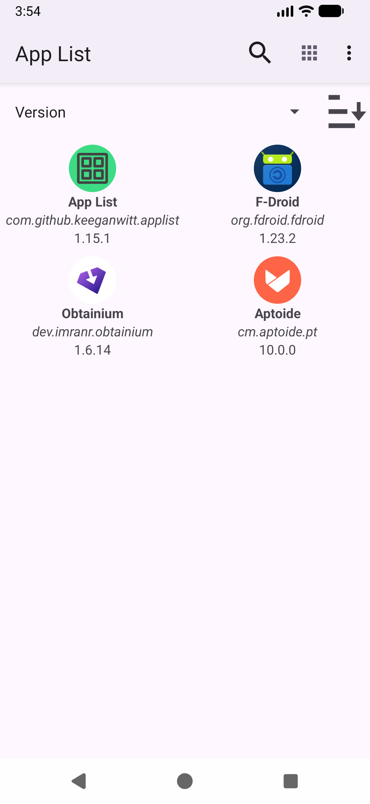
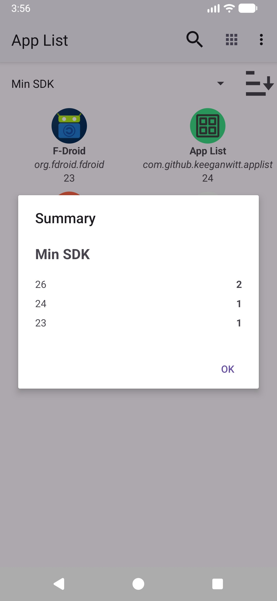
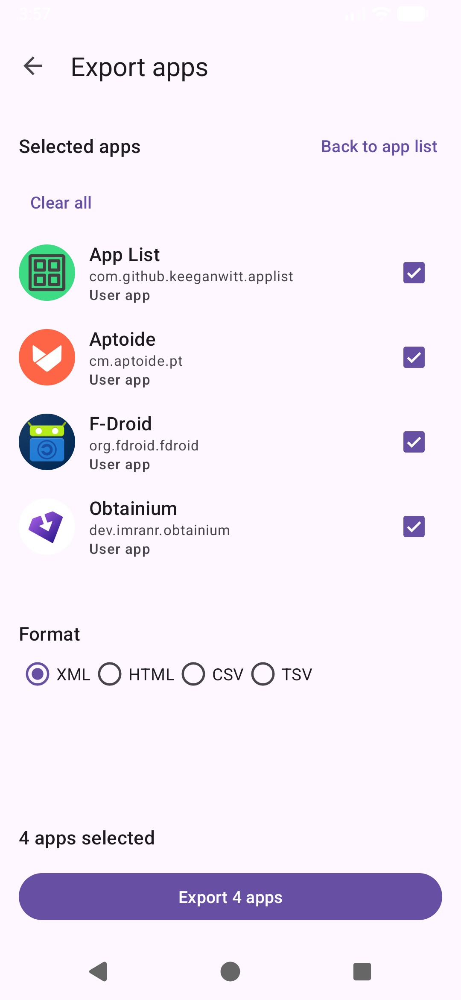

# App List

[](https://github.com/keeganwitt/android-app-list/actions/workflows/android.yml)
[](https://codecov.io/github/keeganwitt/android-app-list)

[Google Play](https://play.google.com/store/apps/details?id=com.github.keeganwitt.applist) · [Amazon Appstore](https://www.amazon.com/dp/B0GQJLMX38)

App List lets you select an application field and compare it across all the apps on your Android device at a glance.

## Features

- Compare details such as version, installer, SDK levels, permissions, storage use, installation dates, last-used time, enabled or archived status, and store availability.
- Search the app list, sort in either direction, and show or hide system and archived apps.
- View a summary of the selected field across your apps.
- Export selected user, system, or archived apps as XML, HTML, CSV, or TSV.
- Follow your device theme or choose light or dark mode.

Some storage and last-used fields require optional Usage Access permission. Crash reporting can be disabled in Settings. See the [privacy policy](docs/privacy-policy.html) for details.

## Screenshots

<p>
  
  
  
</p>

## Development

App List requires JDK 21 and Android SDK 37. Run the unit tests with:

```shell
./gradlew test
```

On Windows, use `gradlew.bat test`.

## License

App List is licensed under the [Apache License 2.0](LICENSE).
